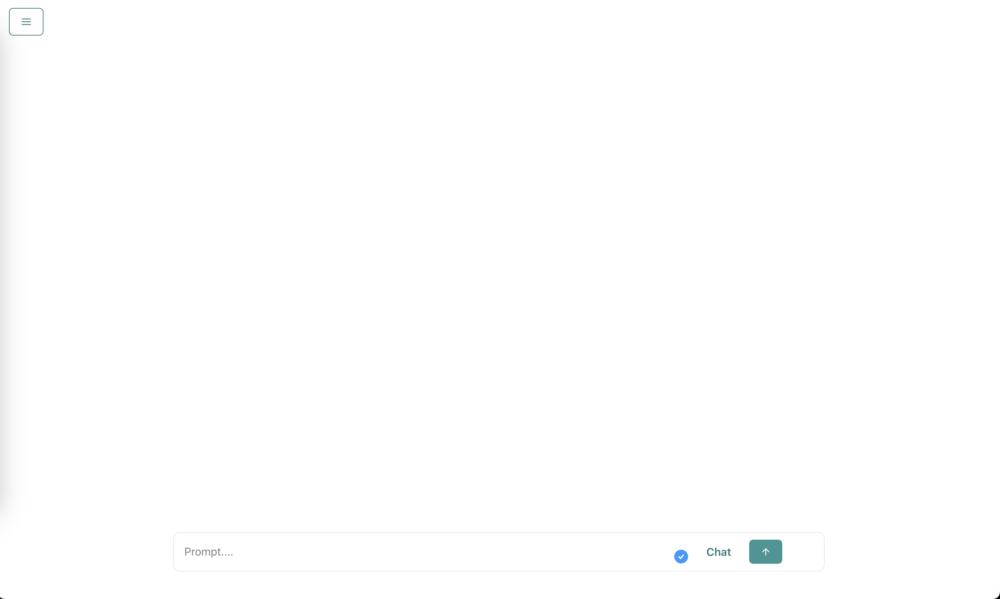
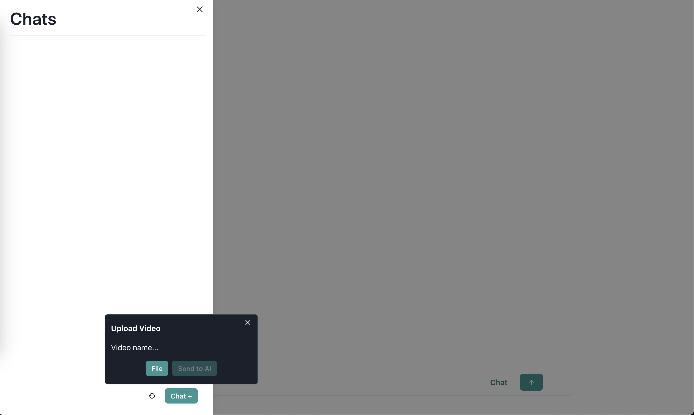
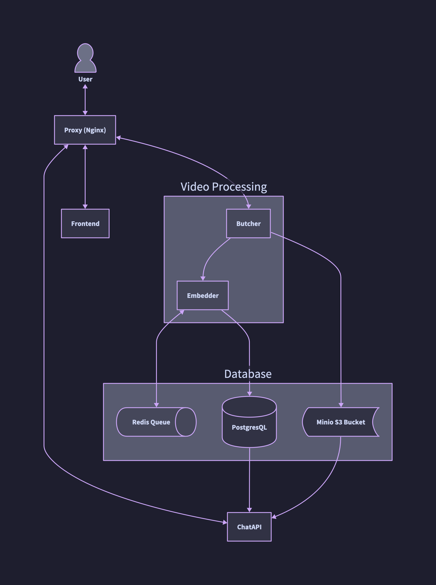

<p align="center">
  
</p>

<h1 align="center">VidMind AI</h1>

<p align="center">
   <i>LLM + VLM Video Analyzer System</i>
</p>

Welcome to the VidMind AI, a project meticulously crafted to explore the realms of artificial intelligence and video comprehension. Developed with a vision to revolutionize video understanding, this system ingeniously integrates the prowess of Language and Vision Models (LLM and VLM) into a unified platform. Drawing inspiration from groundbreaking research papers on Arxiv, this project embarks on a quest to decode the intricacies of hour-long videos, unraveling their essence with unparalleled precision.

While the emergence of OpenAI's groundbreaking GPT-4o model and Google's advancements in video processing might overshadow traditional approaches, the VidMind AI stands as a testament to innovation and exploration. Despite the rapid evolution in video processing technologies, this endeavor serves as a testament to the enduring quest for knowledge and the relentless pursuit of excellence in the realm of artificial intelligence.

**Research Papers:**

- MM-VID: Advancing Video Understanding with GPT-4V(ision): [Link](https://arxiv.org/abs/2310.19773)
- MM-REACT: Prompting ChatGPT for Multimodal Reasoning and Action: [Link](https://arxiv.org/abs/2303.11381)
- VideoPrism: A Foundational Visual Encoder for Video Understanding: [Link](https://arxiv.org/abs/2402.13217)
- Multimodal prompting with a 44-minute movie | Gemini 1.5 Pro Demo: [Link](https://youtu.be/wa0MT8OwHuk?si=ySvZBe81Zr3a4Q3z)

The goal of this project was to see if I could recreate the ideas found in these papers and also have a tool that allows me to quickly search through long-form lecture videos to help aid in note-taking and studying.

This project is primarily powered by OpenAI GPT-4V model.

>[!NOTE]
>As of now, this project is somewhat out of date, since OpenAI just released the GPT-4o model. I'm currently working on getting that working, which can be seen in the roadmap section.

**Cost to Run Project**

The average cost to run this model is somewhat expensive since we are making a lot of calls to GPT-4, but there is currently a solution to limit that cost. The average cost for an hour-long video is about $3 to $5. Additionally, the processing time for a long video is about 7 minutes on average.

## 🤩 Features & Demo

**Features that are currently implemented:**

- Frontend UI that allows for uploading of videos & chatting between different videos, similar to ChatGPT interface
- Functional ChatAPI that accesses a vector database when creating responses from a video
- Video processing and embedding done by OpenAI
- Queuing done by Redis + Bull to handle multiple video processing jobs

**Screenshots**





**YouTube Demo**

[](https://www.youtube.com/watch?v=KphE5YEqWJQ)

## 👀 How Project Works

### System Digram



This whole project is built around the idea of micro-services, allowing for easy development and management of individual services.

Here is a list of what each service does:

### Database

Stores the Redis queue used by the Embedder, along with our S3 bucket (Minio S3) and PostgresSQL database that store video information and vectors for audio and frame data from a video. The PostgresSQL also stores the links to files from the S3 bucket making file fetching easier.

**Tech Breakdown:**

- Redis: Used for queue management
- PostgresSQL: Stores video information and embedding vectors
- Minio S3: Used to store video chunks and other files generated by processing a video

### ChatAPI

Grabs data from the PostgresSQL vector store and then gives it to OpenAI GPT-3.5 model to create chat messages for the user. It also allows for searching of the PostgresSQL vector store, able to get back audio transcriptions and key frames from the video.

**Tech Breakdown:**

- Node.js + TS + Express: Used to create a simple REST API

### Butcher

This service processes the video into chunks (we aim to create 50 chunks from a video, so if we have a 1-hour-long video, we should get 50 chunks that are 1 minute per chunk). And from those chunks, we then start extracting audio and key frames that we will then give to the Embedder for processing with GPT-4 model and creating embeddings for us to put into the PostgresSQL vector store.

**Tech Breakdown:**

- Python + Flask: Handle uploads of files and create an HTTP API that can be used
- FFMPEG: Chunking videos into segments that can be further processed
- PySceneDetect: Getting the most important frames from a video chunk

**Notes**

How to calculate total video chunks and the number of seconds for video chunk:

Percentage can be, for example, 0.002, which is 2%

Total time seconds / (total time seconds * percentage) = number of clips

Total time seconds * percentage = number of seconds per clip

### Embedder

This service takes a JSON that stores all the data created by the Butcher and then adds it to a job queue in Redis. It then pulls from that job queue and tries to process all the information gathered about the video and gives it to GPT-4 to try and create a detailed description for each key frame we were able to find. We then embed all that information and store it into the PostgresSQL vector store for use by the ChatAPI

**Tech Breakdown:**

- Node.js + TS + Express: Used to create a simple REST API
- BULL: Manage Redis queue 
- LangChain: Handle prompts and embedding 

### Frontend

A simple react-app used to interact with all systems and make it easy to use. Trying to copy ChatGPT interface.

**Tech Breakdown:**

- React
- Serve: Spin up a static React server

### Proxy

We use a reverse proxy to help manage connections between someone wanting to use this system and connecting each individual micro-service.

**Tech Breakdown:**

- Nginx

## 🎯 Roadmap & Future Ideas

**Todo list of features:**

- [ ] Need to implement Batch API, which will allow for bigger video inputs and 50% cost cut. This will make video processing time take longer than the 7 minutes average, however, this will save on cost by 50% and allow for less rate limiting errors.
  - [ ] Expand out frame processing to be 150 video chunks instead of 50 video chunks.
  - [ ] Use batching API for video processing.
  - [ ] Use batching API for embedding job.
  
- [ ] Use new GPT-4o model for video processing of frames from a video.
- [ ] Cleanup ChatAPI to be more friendly to use and allow others to use the API for their own projects.

**Todo list of experimental ideas:**

- [ ] Rewrite prompts to see if we can improve GPT response.
- [ ] Try using GPT-4 for ChatAPI.
- [ ] Try converting system to use open-source models.
- [ ] Abstract microservices to call a custom AI service that allows the whole system to not care which AI model is being used, allowing for more flexibility with the use of open-source and other AI models.
- [ ] Figure out a better development experience.

## 🏃‍♂️ How to Run Project

### Requirements

You must have Docker installed on your machine in order to run this project.

### Steps to Run Project

#### 1. Clone the repository and change directory into it

```sh
git clone [this repo]
cd vidmind-ai
```

#### 2. Navigate into the `db` folder and create the following `.env` file

```txt
POSTGRES_USER=your_username
POSTGRES_PASSWORD=your_password
POSTGRES_HOST_AUTH_METHOD=trust

MINIO_ROOT_USER=your_username
MINIO_ROOT_PASSWORD=your_password 
```

>[!IMPORTANT] 
>password should be at least 8 char long for MinIO to work properly

We need to create a `.env` file and store the password in it so that we can access it through our other services requiring database credentials.

#### 3. Now, execute the following command to instruct Docker to run the databases:

```sh
docker-compose --env-file .env up 
```

This command will initiate a PostgreSQL database, a Minio S3 bucket, and Redis for you.

#### 4. Now we need to set up our S3 bucket to accept requests made to it.

Open your web browser and navigate to `localhost:9001`. Use the same username and password you created in the `.env` file stored in the `db` folder under MINIO. Once logged in, you should see only one bucket called `video-files`. Click on the settings icon and then proceed to create an access key. Please save that key somewhere safe or simply remember it since we will need it later.

If you need more assistance setting up Minio, visit [this link](https://min.io/docs/minio/container/index.html).

#### 5. Now we can start running our microservices. The first one we are going to run is the Butcher.

Change directories back to the root of the project and then `cd` into the `Butcher` directory. Create the following `.env` file:

```txt
S3_KEY=the_minio_key_from_before
S3_PWD=the_minio_pwd_from_before
```

Then run the following Docker Compose command:

```sh
docker-compose -f ./prod.docker-compose.yml --env-file .env up 
```

This will run the Butcher service on port 3030.

#### 6. Next, we are going to run the Embedder.

Change directories back to the root of the project and then `cd` into the `Embedder` directory. Create the following `.env` file:

```txt
OPENAI_API_KEY=your_openai_key
DB_USER=username_used_when_creating_db
DB_PWD=pwd_used_when_creating_db
```

Then run the following Docker Compose command:

```sh
docker-compose -f ./prod.docker-compose.yml --env-file .env up 
```

This will run the Embedder service on port 4040.

#### 7. Next, we are going to run the ChatAPI.

Change directories back to the root of the project and then `cd` into the `ChatAPI` directory. Create the following `.env` file:

```txt
OPENAI_API_KEY=your_openai_key
DB_USER=username_used_when_creating_db
DB_PWD=pwd_used_when_creating_db
```

Then run the following Docker Compose command:

```sh
docker-compose -f ./prod.docker-compose.yml --env-file .env up 
```

This will run the ChatAPI service on port 5050.

#### 8. Next, we are going to run the Frontend.

Change directories back to the root of the project and then `cd` into `Frontend`.

Then run the following Docker Compose command:

```sh
docker-compose -f ./prod.docker-compose.yml up 
```

This will run the Frontend service on port 8080.

#### 9. Next, we are going to run the Nginx Proxy to connect everything together.

Change directories back to the root of the project and then `cd` into `proxy`.

Then run the following Docker Compose command:

```sh
docker-compose up 
```

This will run the proxy service on port 80.

#### 10. Now you are all set up! (I know it's a lot, will try to fix this)

Now you can open your web browser, type in `localhost`, and start playing around with the project.

### Running in Development Mode

Follow the same steps as in How to Run Project, but instead of doing `docker-compose -f prod.docker-compose.yml`, do `docker-compose -f dev.docker-compose.yml` and make sure to add `--watch` at the end of the command so Docker watches for any file changes. Also, make sure you delete any running Docker images and compose groups before doing so, since the dev container uses the same name as the production ones to help save on having to rewrite stuff.

## 😎 Contributing

Thank you for considering contributing! Whether you're fixing a bug, improving the documentation, or adding a new feature, your contribution is greatly appreciated.

### How to Contribute

1. **Fork the Repository:** Start by forking the repository to your GitHub account. This will create a copy of the project in your account.

2. **Clone the Repository:** Clone the forked repository to your local machine using the following command:
   ```sh
   git clone [this repo github url]
   ```

3. **Create a Branch:** Create a new branch for your contribution using a descriptive name. For example:
   ```sh
   git checkout -b [your-github-username]/new-feature
   ```

4. **Make Changes:** Make your desired changes to the codebase. Ensure that your changes adhere to the project's coding standards and conventions.

5. **Commit Changes:** Once you've made your changes, commit them to your branch with a descriptive commit message:
   ```sh
   git commit -m "Add new feature: description of your changes"
   ```

6. **Push Changes:** Push your changes to your forked repository on GitHub:
   ```sh
   git push origin feature/new-feature
   ```

7. **Submit a Pull Request:** Go to the GitHub page of your forked repository and submit a pull request to the main repository's `main` branch. Provide a clear title and description for your pull request, explaining the purpose of your changes.

### Code Style Guidelines

- Follow the existing code style and formatting conventions used in the project.
- Ensure that your code is well-documented, with clear comments where necessary.
- Write meaningful commit messages that accurately describe the changes you've made.

### Reporting Issues

If you encounter any bugs, issues, or have suggestions for improvements, please open an issue on the issue tab of the main repository. Provide detailed information about the problem and steps to reproduce it, if applicable.